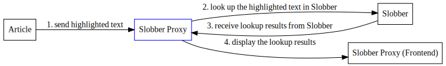

# Slobber Proxy
## Description
Slobber Proxy is a program that allows people to look up words' definition in realtime. Simply by highlighting the word you want to look up, the results will automatically be shown. 

As browsers like Floorp and Microsoft Edge recently supported split-view, you can enjoy a streamlined workflow for language learning. For example, you can open Slobber Proxy on one panel while reading an article on another panel.

## Demo


## Requirements
Slobber Proxy itself works in practically all modern operating systems. But to actually be able to look up dictionaries, you also need 

1. Slobber, which requires Java (please refer to the instructions on <https://github.com/itkach/aard2-web>)
2. a modern browser (e.g. Chrome or Firefox)
3. a userscript browser addon (e.g. Violentmonkey)

## Setup
1. install "userscript/redirect.js" with the userscript manager
2. run Slobber
3. run Slobber Proxy in another shell
4. open http://127.0.0.1:3333/

## How does Slobber Proxy work? 


For security reasons, browsers restrict cross-origin HTTP requests initiated from scripts. Therefore, the highlighted text cannot be sent to Slobber directly. Instead, a proxy server which allows CORS was created to redirect queries to Slobber. 

[Aard2-Web](https://github.com/itkach/aard2-web) has provided a great web frontend interface. To enable it to communicate with the proxy server, I reimplemented the frontend with reference to the original code. The UI behaviour was rewritten in pure Vanilla Javascript instead of jQuery to further strip off library dependencies. Despite different underlying logic, I strived to offer an user experience similar to Aard2-Web so the their interface were basically identical except that the sidebar is now resizable. 

To prevent an overwhelming number of requests from the proxy frontend, a long polling mechanism has been implemented, allowing the frontend to receive data as soon as it becomes available, thereby reducing the frequency of unnecessary requests.

## Build From Source
```
go build -o ./build/main ./main.go
```

## Contribution
Feel free to file issues or pull requests.